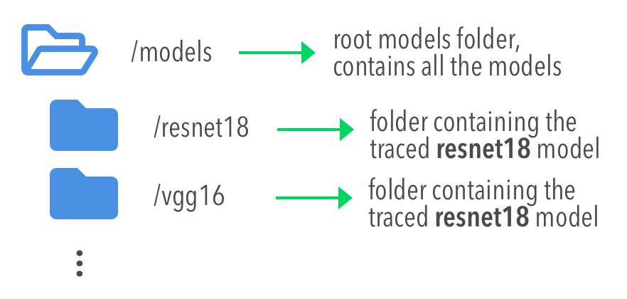

.. _section-configuring:

Configuring EuclidesDB
===============================================================================
This section provides information on how to configure EuclidesDB, how to add new models and how to execute the server. EuclidesDB has two main kinds of configuration: the configuration for the server and configuration for each model you add on EuclidesDB.

Main Configuration
-------------------------------------------------------------------------------
The main configuration is responsible for the settings related to the server itself, an example of this configuration can be seen below:

.. code-block:: ini

	[server]
	address = 127.0.0.1:50000
	log_file_path = /home/user/euclidesdb/logfile.log
	search_engine = annoy

	[annoy]
	tree_factor = 2

	[models]
	dir_path = /home/user/euclidesdb/models

	[database]
	db_path = /home/user/euclidesdb/database

As you can see, there are three sections in this configuration: server, models and database. The description of each one of these fields are shown below:

- ``server.address``: the address server will use to listen, if you with to listen on all interfaces, please use the IP ``0.0.0.0`` and the port you want to use;
- ``server.log_file_path``: this is the path for logging file. Logging is also output to the stdout, but it will also be written in this file;
- ``server.search_engine``: this is the search engine that will be used, it can be one of: ``annoy``, ``faiss`` or ``exact_disk``. Configuration for each search engine is described later;
- ``models.dir_path``: this is the directory path for the models, please refer to the section :ref:`model-config` for more information, this path points to a folder where each model is present;
- ``database.db_path``: this is the directory path for the database storage. EuclidesDB uses a key-value database based on `LevelDB <http://leveldb.org/>`_ to store all features from each item added into the database;

.. note:: Remember to always use **absolute paths** in EuclidesDB configuration files.

.. _search-config:

Search Engine Configuration
-------------------------------------------------------------------------------
EuclidesDB comes with many different search engines. To choose the search engine, please set the ``search_engine`` configuration parameter in the ``server`` section of the configuration file. This parameter will specify which search engine EuclidesDB will use for index/search.

The ``search_engine`` can assume one the following parameters:

* ``annoy``: uses the `Annoy <https://github.com/spotify/annoy>`_ indexing/search method;
* ``exact_disk``: uses EuclidesDB on-disk (as opposite to in-memory) linear exact search;
* ``faiss``: uses the `Faiss <https://github.com/facebookresearch/faiss>`_ indexing/search methods;

Each one of these search engines has their pros and cons. For example, ``faiss`` can provide you a wide spectrum of index methods that offers various trade-offs with respect to search time, search quality, memory, training time, etc. In summary, each search engine will have their own configuration parameters.

``annoy`` Configuration
^^^^^^^^^^^^^^^^^^^^^^^^^^^^^^^^^^^^^^^^^^^^^^^^^^^^^^^^^^^^^^^^^^^^^^^^^^^^^^^
The Annoy search engine configuration accepts only one parameter, called `tree_factor`. This parameter can be specified in the EuclidesDB configuration as seen below (with other configs omited for brevity):

.. code-block:: ini

	[server]
	(...)
	search_engine = annoy

	[annoy]
	tree_factor = 2

	(...)

Description of Annoy parameters:

* ``tree_factor``: this number is multiplied by the model space feature size (512 for ResNet8 for example). The default value is 2, which means that if you have a model space with 512 features, the index will use 1024 trees. More trees gives higher precision when querying.

.. note:: For more information regarding how Annoy works, please see `Annoy documentation <https://github.com/spotify/annoy#how-does-it-work>`_ or the `excellent presentation <https://www.slideshare.net/erikbern/approximate-nearest-neighbor-methods-and-vector-models-nyc-ml-meetup>`_ from Erik Bernhardsson.

``exact_disk`` Configuration
^^^^^^^^^^^^^^^^^^^^^^^^^^^^^^^^^^^^^^^^^^^^^^^^^^^^^^^^^^^^^^^^^^^^^^^^^^^^^^^
The search engine ``exact_disk`` is a very simple, but exact search engine. It will iterate over all items in the database (on the disk, hence the name ``exact_disk``) and it will calculate the distance among the query and all items.

A configuration example is shown below (with other configs omited for brevity):

.. code-block:: ini

	[server]
	(...)
	search_engine = exact_disk

	[exact_disk]
	pnorm = 2
	normalize = false

	(...)

A descripton of each parameter is shown below:

* ``pnorm``: this is the `p-norm <https://en.wikipedia.org/wiki/Lp_space>`_ used to calculate the distance, the default value is 2 (euclidean distance);
* ``normalize``: when ``true``, it will normalize feature vectors before doing the comparison. If you use a ``pnorm = 2`` and ``normalize = true``, you'll recover cosine similarity.

``faiss`` Configuration
^^^^^^^^^^^^^^^^^^^^^^^^^^^^^^^^^^^^^^^^^^^^^^^^^^^^^^^^^^^^^^^^^^^^^^^^^^^^^^^
The ``faiss`` search engine is perhaps the one that offers the largest amount of indexing types. A configuration example is shown below (with other configs omited for brevity):

 .. code-block:: ini

	[server]
	(...)
	search_engine = faiss

	[faiss]
	metric = l2
	index_type = Flat

	(...)

The ``faiss`` search engine has two parameters: ``metric`` and the ``index_type``, however, the ``index_type`` is also a way to provide other parameters to build the index according to some patterns.

Here is a description of each parameter:

- ``metric``: if equals to ``l2`` (default), it will use the euclidean distance. If this parameter is equal to ``inner_product`` it will use the inner-product for the distance;
- ``index_type``: this defines the index `index factory string <https://github.com/facebookresearch/faiss/wiki/Faiss-indexes>`_ from Faiss. For instance, a ``Flat`` value will build an index that uses brute-force L2 distance for search. If this parameter contains the value ``PCA80,Flat`` the search engine will produce an index by applying a PCA to reduce it to 80 dimensions and then a exhaustive search.

.. note:: For more information regarding the Faiss index types and index factory strings, please refer to the `Faiss summary of indexes <https://github.com/facebookresearch/faiss/wiki/Faiss-indexes>`_ or the `Faiss index factory tutorial <https://github.com/facebookresearch/faiss/wiki/Index-IO,-index-factory,-cloning-and-hyper-parameter-tuning#index-factory>`_. If you are unsure about which index to use, please take a look on the `Guidelines to choose an index <https://github.com/facebookresearch/faiss/wiki/Guidelines-to-choose-an-index>`_.

.. _model-config:

Model Configuration
-------------------------------------------------------------------------------
The models are structured in a folder hierarchy where each sub-folder of the models directory contains a PyTorch `traced module <https://pytorch.org/docs/master/jit.html>`_ file together with a configuration file. This structure can be seen below:

The configuration file for the model must have the name **model.conf** and should follow the formatting below:

.. code-block:: ini

	[model]
	name = resnet18
	filename = resnet18.pth
	prediction_dim = 1000
	feature_dim = 512

As you can see, this file contains settings related to the model itself. This is the description for each configuration field:

 - ``model.name``: this is the name of the model that will be used for the EuclidesDB calls when you want to query an index or add a new item for example. A good practice is to use the same name of the folder;
 - ``model.filename``: this is the serialized traced module filename, it is the output of the PyTorch tracing;
 - ``model.prediction_dim``: this is prediction dimension of your model. Since EuclidesDB stores the finaly prediction layer as well as model features, you should provide the dimension of the prediction classes. For example, in a model trained on ImageNet, this will be 1000, meaning that there are 1000 prediction classes;
 - ``model.feature_dim``: this is feature dimension of your model, depending on your model this will have a different size. For the VGG-16 module for instance, this will be 4096, meaning that there is a 4096-dimension vector for the features. As you can note, this should be a flattened vector no matter what model you use;

 With these configurations, EuclidesDB is able to use any custom model.

How to add a new model
-------------------------------------------------------------------------------
Adding a new model into EuclidesDB is straightforward, all you need is to follow the requirements below:

 - **Normalization assumption**: we follow a normalization assumption similar to PyTorch `torchvision models <https://pytorch.org/docs/stable/torchvision/models.html>`_. EuclidesDB will forward images into your model ``forward()`` method by scaling each pixel to be between 0 and 1. Then you can normalize the data as you wish on your traced module as we'll show later;
 - **Return Tensors**: EuclidesDB stores two vectors from each item (or image), the first is the predictions (class predictions) and the second is the features that you want to store and use to index images to query later. For that reason, within your ``forward()`` method, you should always return a tuple with **(predictions, features)** and **respecting** the ordering of the elements;

Here is a simple example from EuclidesDB, where it uses the ResNet-18 from torchvision to build a traced module that can be loaded later by EuclidesDB:

.. code-block:: python

	from torchvision.models import resnet
	import torch.utils.model_zoo as model_zoo

	import torchvision
	import torch

	import torch.nn.functional as F

	class ResnetModel(resnet.ResNet):
	    def forward(self, x):
	        x = self.conv1(x)
	        x = self.bn1(x)
	        x = self.relu(x)
	        x = self.maxpool(x)

	        x = self.layer1(x)
	        x = self.layer2(x)
	        x = self.layer3(x)
	        x = self.layer4(x)

	        x = self.avgpool(x)
	        x_feat = x.view(x.size(0), -1)
	        x = self.fc(x_feat)
	        predictions = F.softmax(x, dim=0)

	        return predictions, x_feat

	def resnet18(pretrained=False, **kwargs):
	    model = ResnetModel(resnet.BasicBlock, [2, 2, 2, 2], **kwargs)
	    if pretrained:
	        model.load_state_dict(model_zoo.load_url(resnet.model_urls['resnet18']))
	    return model

	class Resnet18Module(torch.jit.ScriptModule):
	    def __init__(self):
	        super(Resnet18Module, self).__init__()
	        self.means = torch.nn.Parameter(torch.tensor([0.485, 0.456, 0.406])
	                                        .resize_(1, 3, 1, 1))
	        self.stds = torch.nn.Parameter(torch.tensor([0.229, 0.224, 0.225])
	                                        .resize_(1, 3, 1, 1))
	        resnet_model = resnet18(pretrained=True)
	        resnet_model.eval()
	        self.resnet = torch.jit.trace(resnet_model,
	                                      torch.rand(1, 3, 224, 224))

	    @torch.jit.script_method
	    def helper(self, input):
	        return self.resnet((input - self.means) / self.stds)

	    @torch.jit.script_method
	    def forward(self, input):
	        return self.helper(input)

	model = Resnet18Module()
	model.eval()
	traced_net = torch.jit.trace(model,
	                             torch.rand(1, 3, 224, 224))
	traced_net.save("resnet18.pth")

As you can see, this script is doing some stiching to keep the pre-trained weights from the torchvision model, however all you need is a PyTorch module that returns the predictions and features from the ``forward()`` method and then you just need to call the ``torch.jit.trace()`` to trace your model and produce the traced module file, which in our case is the ``resnet18.pth``.

.. note:: Remember to set your model to ``eval()`` mode before tracing it, otherwise you might get inconsistent results due to layers that have different behavior during training and prediction time, such as Dropout and BatchNormalization.

After that, you just need to add this model into a sub-folder inside the models folder and add the configuration file for the model specifying the name of the model and other settings as show in the previous section. 

.. note:: For more help on how to trace PyTorch modules, please refer to `PyTorch TorchScript documentation <https://pytorch.org/docs/master/jit.html>`_. 
