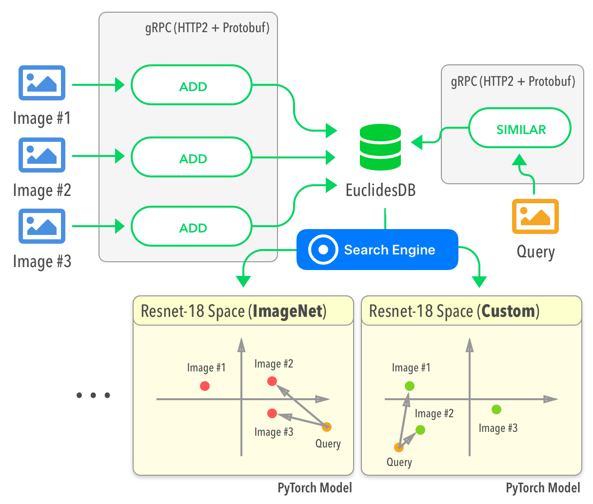

Welcome to EuclidesDB !
======================================

EuclidesDB is a multi-model machine learning feature database that is tight coupled with PyTorch and provides a backend for including and querying data on the model feature space. Some features of EuclidesDB are listed below:

* Written in C++ for performance;
* Uses protobuf for data serialization;
* Uses gRPC for communication;
* LevelDB integration for database serialization;
* Uses LSH (`Annoy <https://github.com/spotify/annoy>`_) for approximate nearest neighbors search;
* Tight PyTorch integration through libtorch;
* Easy integration for new custom fine-tuned models;
* Easy client language binding generation;
* Free and open-source with permissive license;

.. note:: EuclidesDB is still in its **initial release** and many new features are going to come in the next versions. The client API **might change** in the upcoming releases before we stabilize on a robust API design. Contributions are also welcome ! If you want to contribute, please refer to the :ref:`section-contributing` section.

.. toctree::
   :maxdepth: 4
   :caption: Contents:

   getstarted
   installation
   configuration
   client
   contributing
   license

Indices and tables
==================

* :ref:`genindex`
* :ref:`modindex`
* :ref:`search`
